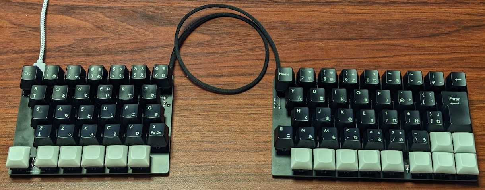

# USB HID Keyboard firmware for TinyGo

**The API is not yet fixed.**  


The following are supported.  

* key input
    * matrix scan / duplex-matrix scan
    * rotary encoder
    * GPIO
    * UART
* layer feature by mod key
* mouse click / mouse wheel
* support TRRS (UART)

## Microcontrollers

The following microcontrollers are supported.  

* nrf52840
* rp2040

## sgkb-0.2.0



```
$ tinygo flash --target xiao-rp2040 --size short ./targets/sgkb/left/
$ tinygo flash --target xiao-rp2040 --size short ./targets/sgkb/right/
```

* files
    * [./kicad/sgkb](./kicad/sgkb/)

| name | amount |
| ---- | ------ |
| Cherry MX / Kailh Choc V1 | 72 |
| key cap | 72 |
| diode 1N4148 | 72 |
| xiao-rp2040 | 2 |
| pin header 1x7 | 4 |
| TRRS connector | 2 |
| TRRS cable | 1 |

left:


right:


## wiokey-0.1.0


```
$ tinygo flash --target wioterminal --size short ./targets/wiokey/
```

* files
    * [./kicad/wiokey](./kicad/wiokey/)

| name | amount |
| ---- | ------ |
| Cherry MX / Kailh Choc V1 | 6 |
| key cap | 6 |
| diode 1N4148 | 6 |
| wioterminal | 1 |
| pin socket 2x20 | 2 |

## sgkey-0.1.0


```
$ tinygo flash --target xiao-rp2040 --size short ./targets/sgkey/
```

* files
    * [./kicad/sgkey](./kicad/sgkey/)

| name | amount |
| ---- | ------ |
| Cherry MX / Kailh Choc V1 | 6 |
| key cap | 6 |
| diode 1N4148 | 6 |
| xiao-rp2040 | 1 |
| i2c ssd1306 | 1 |
| register 10k ohm | 2 |

## MacroPad RP2040


```
$ tinygo flash --target macropad-rp2040 --size short ./targets/macropad-rp2040/
```

* schema
    * https://learn.adafruit.com/adafruit-macropad-rp2040/overview


## Note

The following PR changes are required for all keys to work properly.
However, most keys will work without the following PRs.

> With the previous configurations, keycodes larger than 0x73 cannot be sent.
> For example, we cannot send Left Windows (0xF0E3).

https://github.com/tinygo-org/tinygo/pull/3327

## LICENSE

MIT
