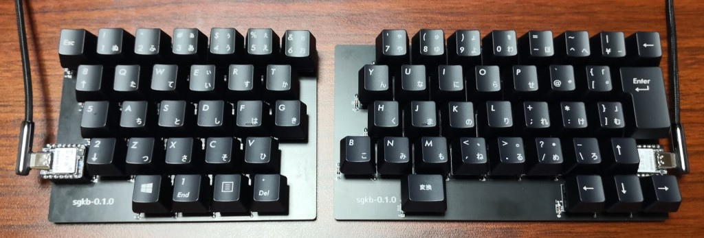
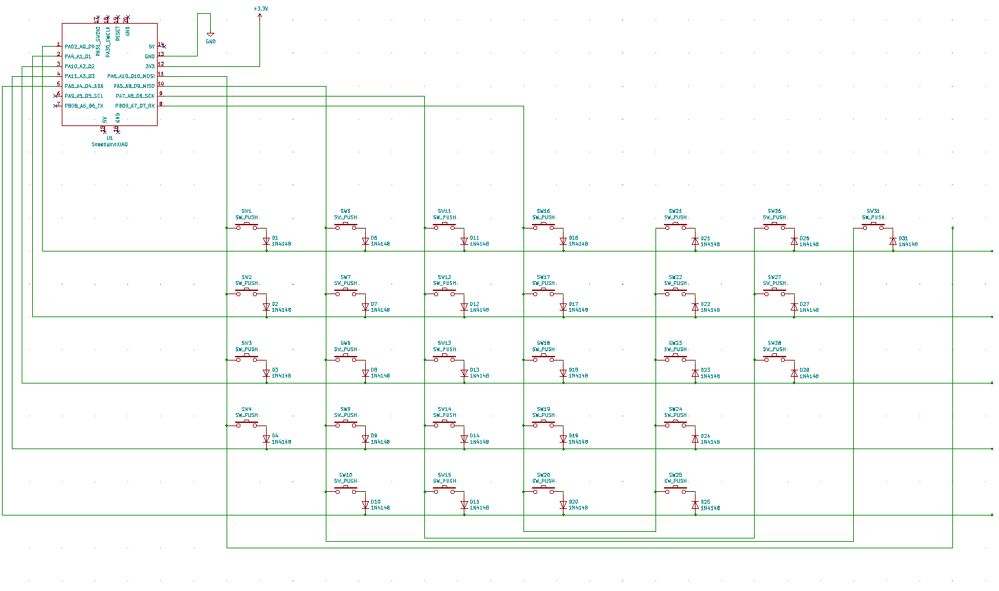
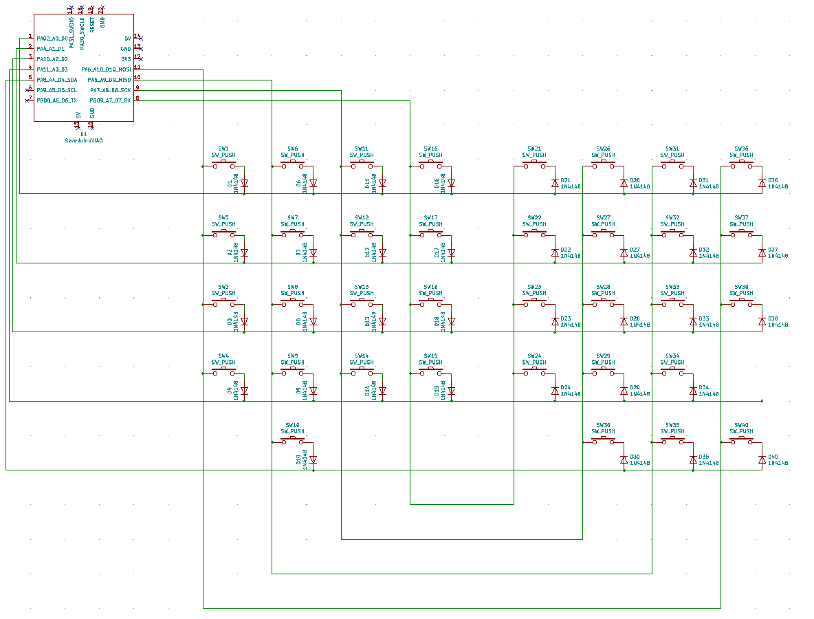

# USB HID Keyboard firmware for TinyGo

**The API is not yet fixed.**  

The following are supported.  

* matrix scan / duplex-matrix scan
* layer feature by mod key
* mouse click / mouse wheel

## Microcontrollers

The following microcontrollers are supported.  

* nrf52840
* rp2040

## sgkb-0.1.0

left:

right:

## Note

The following PR changes are required for all keys to work properly.
However, most keys will work without the following PRs.

> With the previous configurations, keycodes larger than 0x73 cannot be sent.
> For example, we cannot send Left Windows (0xF0E3).

https://github.com/tinygo-org/tinygo/pull/3327

## LICENSE

MIT
