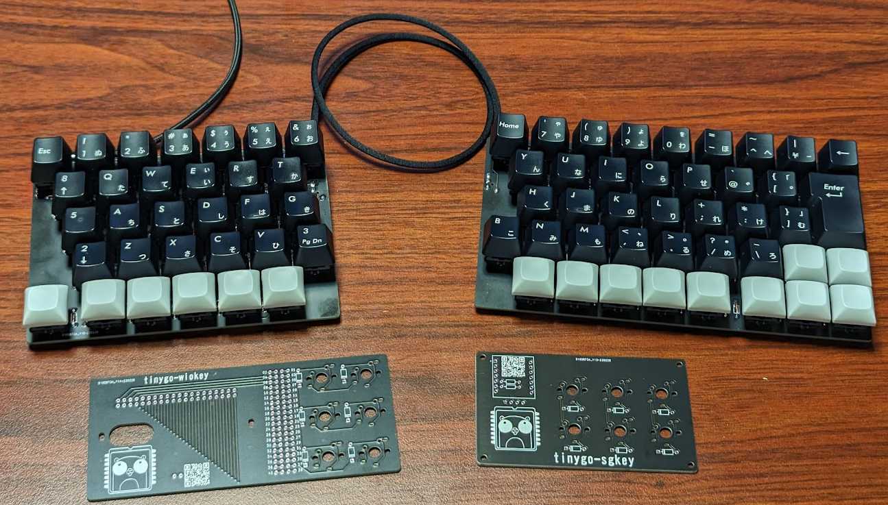
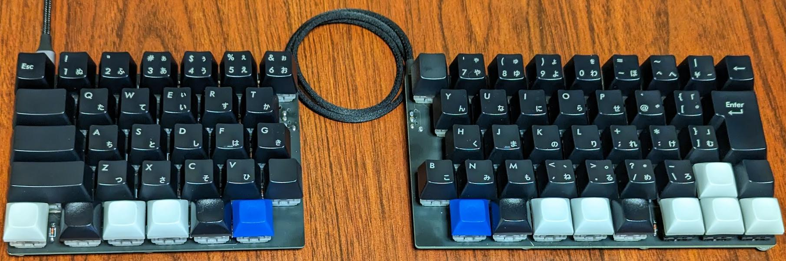
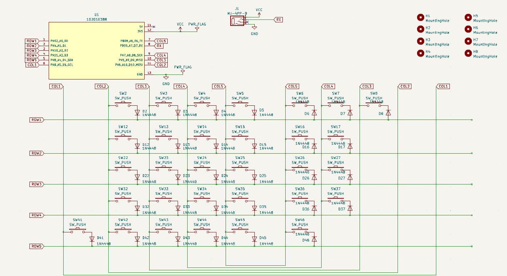
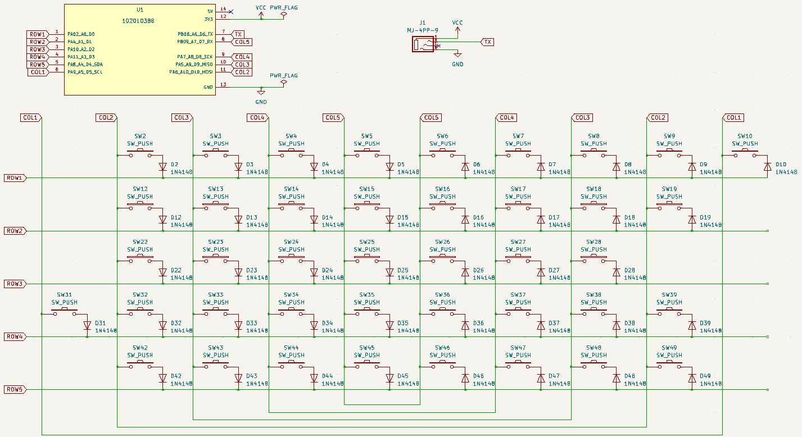
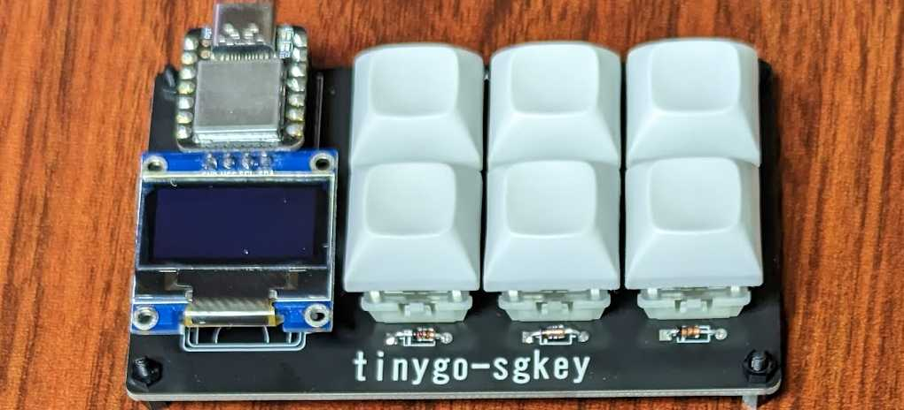
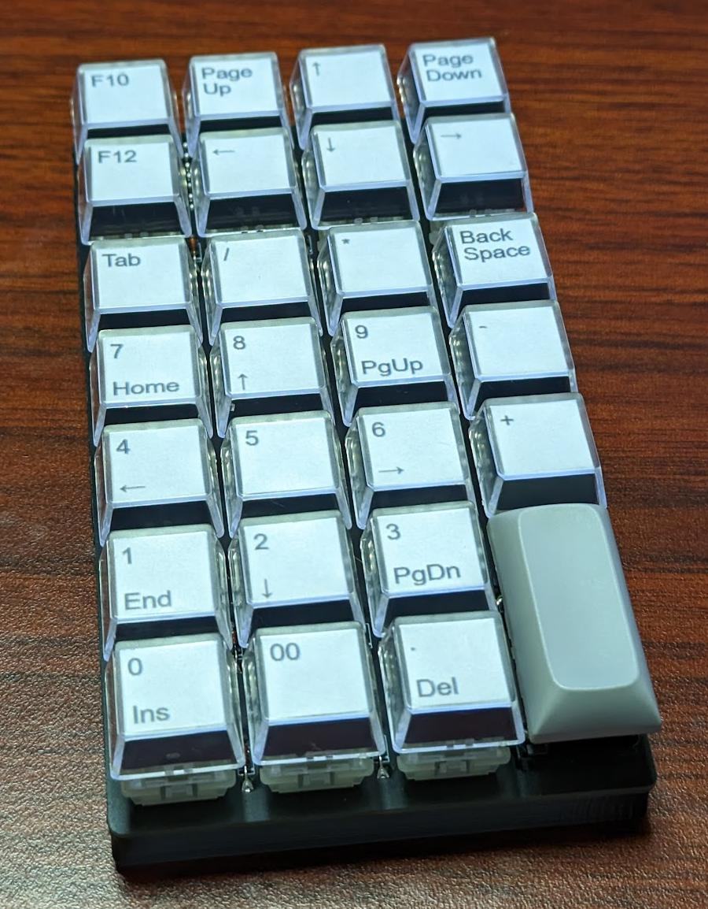
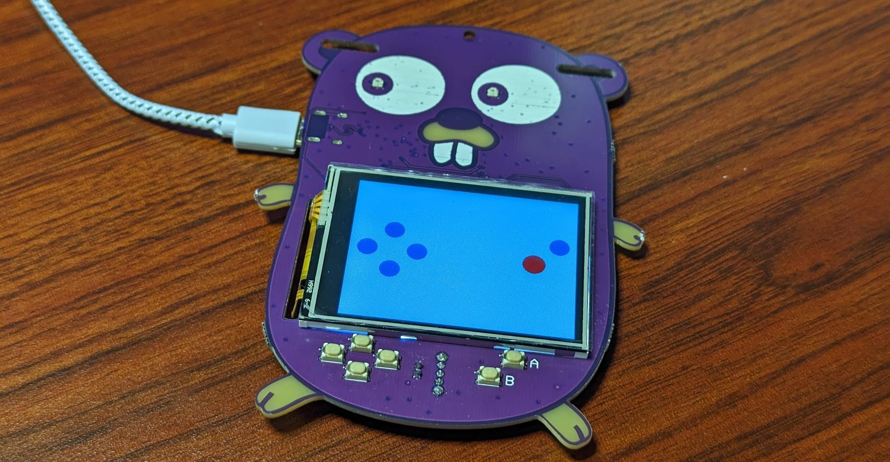
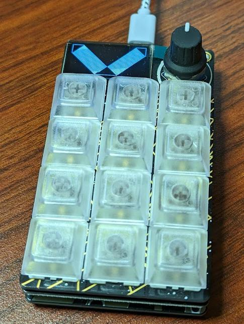

# USB HID Keyboard firmware for TinyGo

**The API is not yet fixed.**  

**TinyGo 0.29 or later is required to build tinygo-keyboard 0.2.0**  



The following are supported.  

* key input
    * squared matrix scan
    * matrix scan / duplex-matrix scan
    * rotary encoder
    * GPIO
    * UART
* layer feature by mod key
* mouse click / mouse wheel
* support TRRS (UART)
* support [Vial](https://vial.rocks/)
    * rp2040 and nrf52840 are supported
    * atsamd21 and atsamd51 will be supported in TinyGo 0.30

## Microcontrollers

The following microcontrollers are supported.  

* rp2040
* nrf52840
* samd51
* samd21

## Tutorial

* [tutorial.md](./tutorial.md)

## sgkb-0.3.0



```
$ tinygo flash --target xiao-rp2040 --size short ./targets/sgkb/left/
$ tinygo flash --target xiao-rp2040 --size short ./targets/sgkb/right/
```

* files
    * [./kicad/sgkb](./kicad/sgkb/) for KiCad 7.0

| name | amount |
| ---- | ------ |
| Cherry MX / Kailh Choc V1 | 72 |
| key cap (1u) | 68 |
| key cap (1.5u) | 1 |
| key cap (1.75u) | 1 |
| key cap (2u) | 1 |
| key cap (ISO-ENTER) | 1 |
| Stabilizer (2u) | 1 |
| diode 1N4148 | 72 |
| xiao-rp2040 | 2 |
| pin header 1x7 | 4 |
| TRRS connector | 2 |
| TRRS cable | 1 |

left:



right:



## wiokey-0.1.0


```
$ tinygo flash --target wioterminal --size short ./targets/wiokey/
```

* files
    * [./kicad/wiokey](./kicad/wiokey/) for KiCad 7.0

| name | amount |
| ---- | ------ |
| Cherry MX / Kailh Choc V1 | 6 |
| key cap | 6 |
| diode 1N4148 | 6 |
| wioterminal | 1 |
| pin socket 2x20 | 2 |

## sgkey-0.1.0



```
$ tinygo flash --target xiao-rp2040 --size short ./targets/sgkey/
```

* files
    * [./kicad/sgkey](./kicad/sgkey/) for KiCad 7.0
* build guide
    * [./targets/sgkey/README.md](./targets/sgkey/README.md)

| name | amount |
| ---- | ------ |
| Cherry MX / Kailh Choc V1 | 6 |
| key cap | 6 |
| diode 1N4148 | 6 |
| xiao-rp2040 | 1 |
| i2c ssd1306 | 1 |
| register 10k ohm | 2 |

## fric10key-0.1.0



```
$ tinygo flash --target xiao-rp2040 --size short ./targets/fric10key/
```

* files
    * [./kicad/fric10key](./kicad/fric10key/) for KiCad 7.0

| name | amount |
| ---- | ------ |
| Cherry MX / Kailh Choc V1 | 27 |
| key cap (1u) | 26 |
| key cap (2u) | 1 |
| Stabilizer (2u) | 1 |
| diode 1N4148 | 27 |
| xiao-rp2040 | 1 |

## Gopher Badge



```
$ tinygo flash --target gopher-badge --size short ./targets/gopher-badge/
```

* schema
    * https://gopherbadge.com/


## MacroPad RP2040



```
$ tinygo flash --target macropad-rp2040 --size short ./targets/macropad-rp2040/
```

* schema
    * https://learn.adafruit.com/adafruit-macropad-rp2040/overview


## Restore default keymap

Set the key with the key code of `0x7C03`, and then press it.  
Then a reset will restore the default keymap.  
See [#8](https://github.com/sago35/tinygo-keyboard/pull/8).

## Restore default keymap (tinygo flash)

Restore default keymap each time it is reset by specifying `--tags reset_to_default`.  
Note that in this setting, any changes made from Vial or other sources will immediately revert to the original setting.  

```
$ tinygo flash --target wioterminal --size short  --tags reset_to_default ./targets/wiokey
```

## Note

The following PR changes are required for all keys to work properly.
However, most keys will work without the following PRs.

> With the previous configurations, keycodes larger than 0x73 cannot be sent.
> For example, we cannot send Left Windows (0xF0E3).

https://github.com/tinygo-org/tinygo/pull/3327

## LICENSE

MIT
