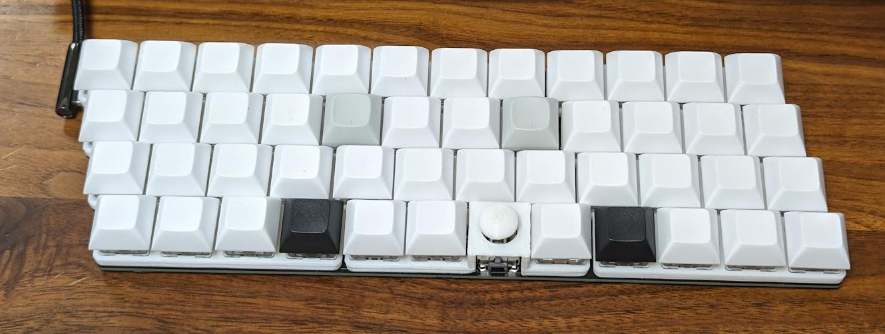
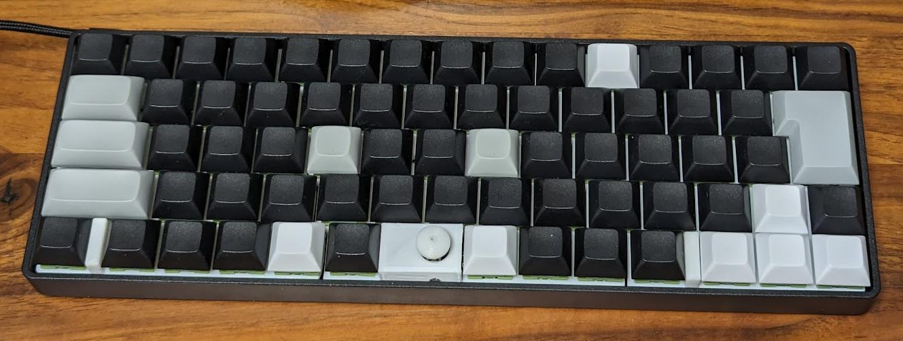
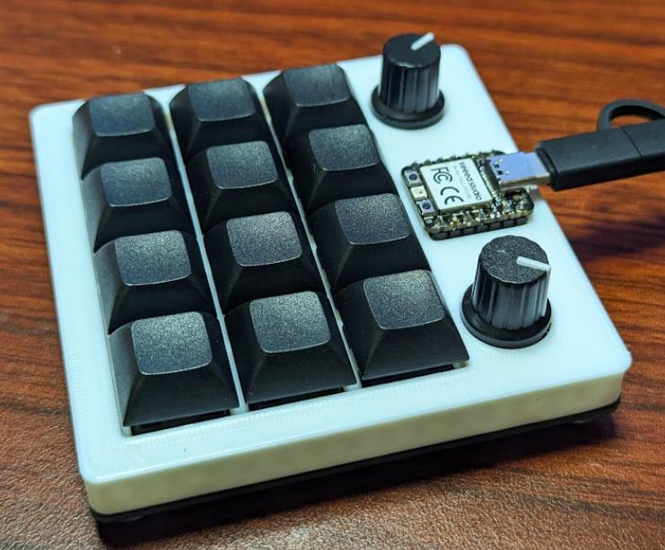

# USB HID Keyboard firmware for TinyGo

**The API is not yet fixed.**  


The following are supported.  

* key input
    * squared matrix scan
    * matrix scan
    * duplex-matrix scan
    * rotary encoder
    * GPIO
    * UART
    * Shifter (tinygo.org/x/drivers/shifter)
* layer feature by mod key
* mouse click / mouse wheel
* support TRRS (UART)
* support [Vial](https://vial.rocks/)
    * Keymap
    * [Layers](https://get.vial.today/manual/layers.html) (MO(x), TO(x))
    * Matrix testers
    * [Macros](https://get.vial.today/manual/macros.html)
    * [Combos](https://get.vial.today/manual/combos.html)

## Microcontrollers

The following microcontrollers are supported.  

* rp2040
* nrf52840
* samd51
* samd21

## Tutorial

* [tutorial.md](./tutorial.md)

## Additional Resources

* [Create Your Own Keyboard with sago35/tinygo-keyboard (dev.to)](https://dev.to/sago35/create-your-own-keyboard-with-sago35tinygo-keyboard-4gbj)
* [自作キーボードをTinyGoで作る (Qiita, Japanese)](https://qiita.com/sago35/items/b008ed03cd403742e7aa)

## sgkb-0.4.0


```
# sgkb-0.4.0
$ tinygo flash --target xiao-rp2040 --size short --stack-size 8kb ./targets/sgkb/left/
$ tinygo flash --target xiao-rp2040 --size short --stack-size 8kb ./targets/sgkb/right/

# sgkb-0.3.0 or before
$ tinygo flash --target xiao-rp2040 --size short --stack-size 8kb ./targets/sgkb/left-0.3.0/
$ tinygo flash --target xiao-rp2040 --size short --stack-size 8kb ./targets/sgkb/right/
```

* files
    * [./kicad/sgkb](./kicad/sgkb/) for KiCad 7.0
        * KiCanvas : [sgkb-0.4.0 left](https://kicanvas.org/?github=https%3A%2F%2Fgithub.com%2Fsago35%2Ftinygo-keyboard%2Ftree%2Fsgkb-0.4.0-dev%2Fkicad%2Fsgkb%2Fsgkb)
        * KiCanvas : [sgkb-0.4.0 right](https://kicanvas.org/?github=https%3A%2F%2Fgithub.com%2Fsago35%2Ftinygo-keyboard%2Ftree%2Fmain%2Fkicad%2Fsgkb-right%2Fsgkb-right)
        * KiCanvas : [sgkb-0.3.0 left](https://kicanvas.org/?github=https%3A%2F%2Fgithub.com%2Fsago35%2Ftinygo-keyboard%2Ftree%2Fea336a62da237ce1e1972d8fc5d999a584e267c3%2Fkicad%2Fsgkb%2Fsgkb)
        * KiCanvas : [sgkb-0.3.0 right](https://kicanvas.org/?github=https%3A%2F%2Fgithub.com%2Fsago35%2Ftinygo-keyboard%2Ftree%2Fea336a62da237ce1e1972d8fc5d999a584e267c3%2Fkicad%2Fsgkb-right%2Fsgkb-right)


| name | amount |
| ---- | ------ |
| Cherry MX / Kailh Choc V1 | 72 |
| key cap (1u) | 68 |
| key cap (1.5u) | 1 |
| key cap (1.75u) | 1 |
| key cap (2u) | 1 |
| key cap (ISO-ENTER) | 1 |
| Stabilizer (2u) | 2 |
| diode 1N4148 | 72 |
| xiao-rp2040 | 2 |
| pin header 1x7 | 4 |
| TRRS connector | 2 |
| TRRS cable | 1 |


## sg48key



```
tinygo flash --target xiao --size short --stack-size 8kb ./targets/sg48key/
```

* files
    * [./kicad/sg48key](./kicad/sg48key/)
        * KiCanvas : [sg48key](https://kicanvas.org/?github=https%3A%2F%2Fgithub.com%2Fsago35%2Ftinygo-keyboard%2Ftree%2Fmain%2Fkicad%2Fsg48key%2Fsg48key)

## sgh60



```
tinygo flash --target waveshare-rp2040-zero --size short --stack-size 8kb ./targets/sgh60/
```

* files
    * [./kicad/sgh60](./kicad/sgh60/)
        * KiCanvas : [sgh60](https://kicanvas.org/?github=https%3A%2F%2Fgithub.com%2Fsago35%2Ftinygo-keyboard%2Ftree%2Fmain%2Fkicad%2Fsgh60%2Fsgh60)

## wiokey-0.1.0


```
$ tinygo flash --target wioterminal --size short --stack-size 8kb ./targets/wiokey/
```

* files
    * [./kicad/wiokey](./kicad/wiokey/) for KiCad 7.0
        * KiCanvas : [wiokey](https://kicanvas.org/?github=https%3A%2F%2Fgithub.com%2Fsago35%2Ftinygo-keyboard%2Ftree%2Fmain%2Fkicad%2Fwiokey%2Fwiokey)

| name | amount |
| ---- | ------ |
| Cherry MX / Kailh Choc V1 | 6 |
| key cap | 6 |
| diode 1N4148 | 6 |
| wioterminal | 1 |
| pin socket 2x20 | 2 |

## sgkey-0.1.0


```
$ tinygo flash --target xiao-rp2040 --size short --stack-size 8kb ./targets/sgkey/
```

* files
    * [./kicad/sgkey](./kicad/sgkey/) for KiCad 7.0
        * KiCanvas : [sgkey](https://kicanvas.org/?github=https%3A%2F%2Fgithub.com%2Fsago35%2Ftinygo-keyboard%2Ftree%2Fmain%2Fkicad%2Fsgkey%2Fsgkey)
* build guide
    * [./targets/sgkey/README.md](./targets/sgkey/README.md)

| name | amount |
| ---- | ------ |
| Cherry MX / Kailh Choc V1 | 6 |
| key cap | 6 |
| diode 1N4148 | 6 |
| xiao-rp2040 | 1 |
| i2c ssd1306 | 1 |
| register 10k ohm | 2 |

## fric10key-0.1.0


```
$ tinygo flash --target xiao-rp2040 --size short --stack-size 8kb ./targets/fric10key/
```

* files
    * [./kicad/fric10key](./kicad/fric10key/) for KiCad 7.0
        * KiCanvas : [fric10key](https://kicanvas.org/?github=https%3A%2F%2Fgithub.com%2Fsago35%2Ftinygo-keyboard%2Ftree%2Fmain%2Fkicad%2Ffric10key%2Ffric10key)

| name | amount |
| ---- | ------ |
| Cherry MX / Kailh Choc V1 | 27 |
| key cap (1u) | 26 |
| key cap (2u) | 1 |
| Stabilizer (2u) | 1 |
| diode 1N4148 | 27 |
| xiao-rp2040 | 1 |

## xiao-kb01



```
$ tinygo flash --target xiao-rp2040 --size short --stack-size 8kb ./targets/xiao-kb01/
```

* files
    * [./kicad/xiao-kb01](./kicad/xiao-kb01/) for KiCad 7.0
        * KiCanvas : [xiao-kb01](https://kicanvas.org/?github=https%3A%2F%2Fgithub.com%2Fsago35%2Ftinygo-keyboard%2Ftree%2Fmain%2Fkicad%2Fxiao-kb01%2Fxiao-kb01)


## Gopher Badge


```
$ tinygo flash --target gopher-badge --size short --stack-size 8kb ./targets/gopher-badge/
```

* schema
    * https://gopherbadge.com/

## GoBadge / PyBadge

```
$ tinygo flash --target gobadge --size short --stack-size 8kb ./targets/gobadge
```

* schema
    * https://learn.adafruit.com/adafruit-pybadge


## MacroPad RP2040


```
$ tinygo flash --target macropad-rp2040 --size short --stack-size 8kb ./targets/macropad-rp2040/
```

* schema
    * https://learn.adafruit.com/adafruit-macropad-rp2040/overview


## Restore default keymap

Set the key with the key code of `0x7C03`, and then press it.  
Then a reset will restore the default keymap.  
See [#8](https://github.com/sago35/tinygo-keyboard/pull/8).

## Restore default keymap (tinygo flash)

Restore default keymap each time it is reset by specifying `--tags reset_to_default`.  
Note that in this setting, any changes made from Vial or other sources will immediately revert to the original setting.  

```
$ tinygo flash --target wioterminal --size short  --tags reset_to_default ./targets/wiokey
```

## Note

* Basically, the `--stack-size 8kb` settings is required.
* If changing the version of tinygo-keyboard causes it to not work properly, please perform the `Restore default keymap` procedure.

## LICENSE

MIT
