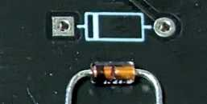
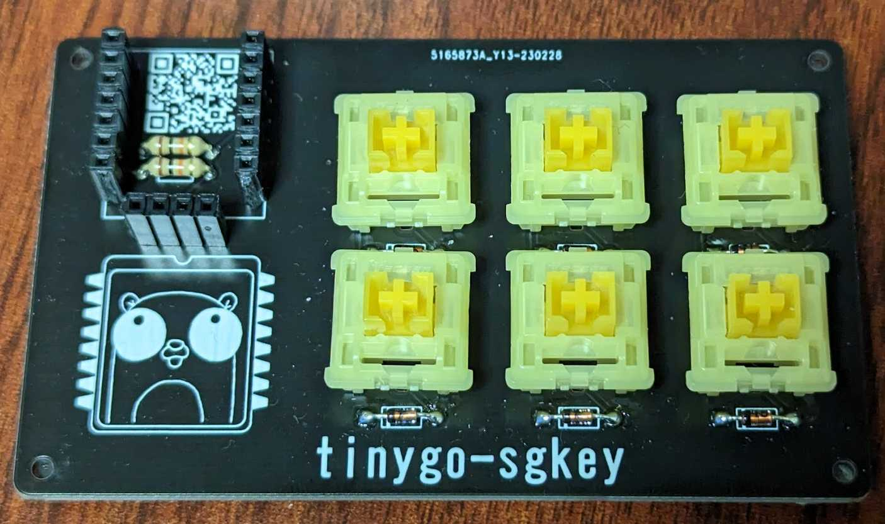
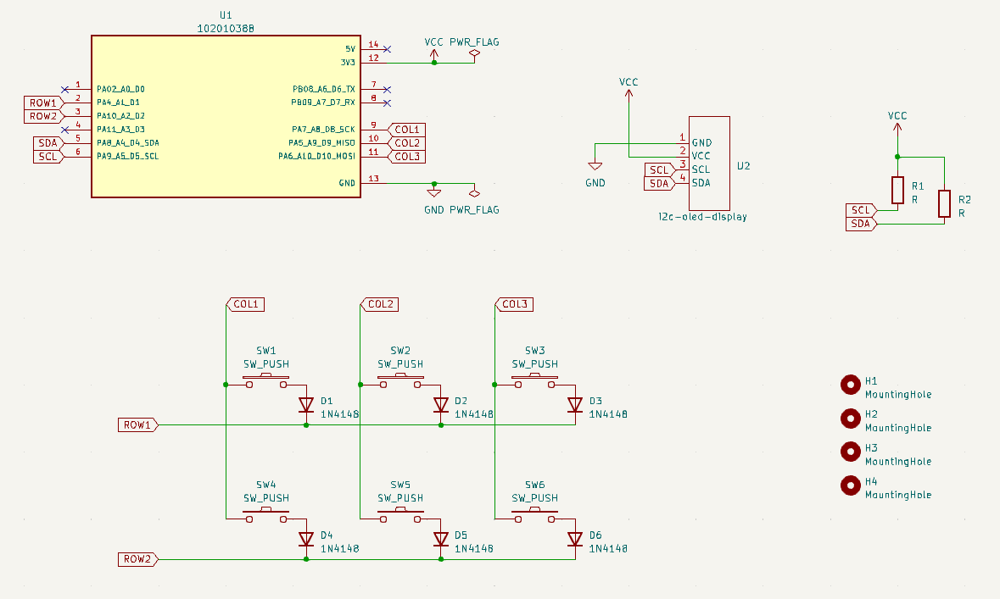
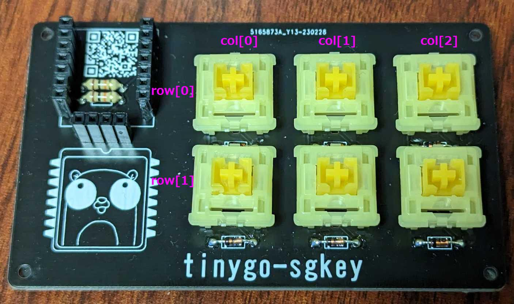

# sgkey

Booth で完成品および基板のみを販売中です。  

* [sgkey (完成品)](https://sago35.booth.pm/items/4766033)
* [sgkey (基板のみ)](https://sago35.booth.pm/items/4766238)

# build guide

組み立てに必要な必須パーツは以下の通り。

| parts | 必要数
| -- | --
| Cherry MX 互換キースイッチ | 6
| キーキャップ | 6
| ダイオード 1N4148 | 6
| XIAO (RP2040 or nRF52840 or SAMD21) | 1
| ピンソケット 1x7 | 2
| ゴム足 | 4 ～ 6

以下は液晶接続時に必要に応じて追加してください。

| parts | 必要数
| -- | --
| 液晶モジュール (ssd1306) | 1
| 抵抗 10kΩ | 2
| ピンソケット 1x4 | 2

以下の順でハンダ付けしていきます。

## 1. ダイオード

ダイオードには向きがあるので、注意してください。  
写真の向きに接続してください。  



## 2. 液晶接続時 : 抵抗

抵抗に向きはありません。  
裏面にハンダ付けしても構いません。  



## 3. ピンソケット 1x7

XIAO 接続用のピンソケットです。  
直接 XIAO をハンダ付けしても構いませんが、先に抵抗をハンダ付けしておくことをお勧めします。  

## 4. 液晶接続時 : ピンソケット 1x4

液晶接続用のピンソケットです。  
直接液晶をハンダ付けしても構いません。  

## 5. キースイッチ

写真のようにハンダ付けしてください。  


# TinyGo firmware

以下で書き込みできます。

```
$ tinygo flash --target xiao-rp2040 --size short .
```

# 回路図

以下に KiCAD 7 用の回路図があります。  

* https://github.com/sago35/tinygo-keyboard/tree/main/kicad/sgkey/sgkey



# ピン配置

| ピン名 | 備考
| -- | --
| D8 | col[0]
| D9 | col[1]
| D10 | col[2]
| D1 | row[0]
| D2 | row[1]
| D4 (SDA) | i2c SDA
| D5 (SCL) | i2c SCL


