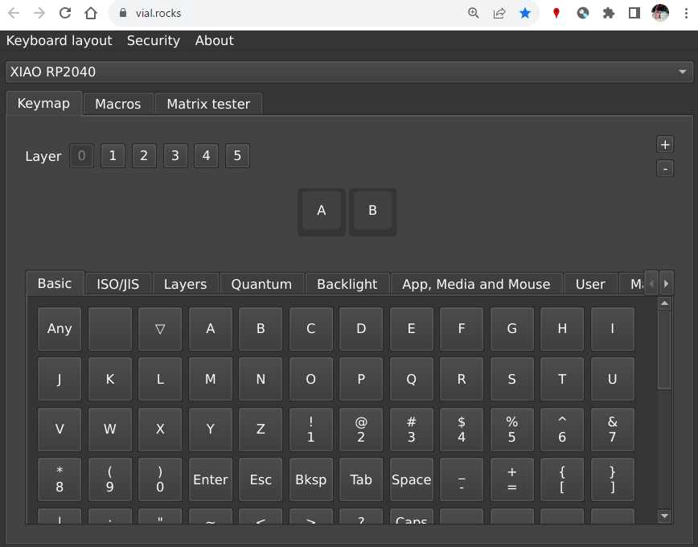

# Tutorial

In this tutorial, you wil learn how to use `tinygo-keyboard` in the following steps:

* Creating a keyboard using GPIO
* Creating a keyboard that can be configured with Vial

## Creating a keyboard using GPIO

`tinygo-keyboard` can operate with simple GPIO.
In this section, we will create a keyboard using GPIO (machine.Pin).
Of course, you can change to other GPIOs and add buttons.

Here, we will use `xiao-rp2040`.

The keys corresponding to each pin are as foloows.

| Pin | Key |
| --- | ----- |
| D0  | KeyA |
| D3  | KeyB |

The wiring is as follows.
We will use D0 and D3 here.


The basic flow is as follows.

1. keyboard.New()
2. Create and initialize a slice of GPIO pins
3. Create a GPIO Keyboard with AddGpioKeyboard()
4. d.Loop()

The entire source code is as follows.
There shouldn't be any particularly difficult parts.

```go
func main() {
	d := keyboard.New()

	gpioPins := []machine.Pin{
		machine.D0,
		machine.D3,
	}

	for c := range gpioPins {
		gpioPins[c].Configure(machine.PinConfig{Mode: machine.PinInputPullup})
	}

	d.AddGpioKeyboard(gpioPins, [][]keyboard.Keycode{
		{
			jp.KeyA,
			jp.KeyB,
		},
	})

	d.Loop(context.Background())
}
```

The working code can be found here:

* [./tutorial/gpio](./tutorial/gpio)

You cna flash with the following command:

```
$ tinygo flash --target xiao-rp2040 --size short ./tutorial/gpio
```

If flash successfully, pressing D0 will input `a`, and pressing D3 will input `b`.

## Creating a keyboard that can be configured with Vial

With Vial, you can change the key settings from a web browser.



First, create a configuration file for Vial.
For details, check Vial's [Create keyboard definition JSON](https://get.vial.today/docs/porting-to-via.html).

Points to note in `tinygo-keyboard` are:

* The file name should be `vial.json` and placed in the same directory as `main.go`
* matrix.rows
  * Set to the same value as the number of keyboards (number of times AddXxxxKeyboard() was called)
* matrix.cols
  * Set to the same as maximum number of buttons of the keyboard (2 in this case)

```json
{
    "name": "tinygo-keyboard-tutorial-gpio-vial",
    "vendorId": "0x2e8a",
    "productId": "0x000a",
    "matrix": {"rows": 1, "cols": 2},
    "layouts": {
        "keymap": [
            ["0,0","0,1"]
        ]
    }
}
```

After creating `vial.json`, execute the following.
`def.go` will be generated in the same directory.

```
$ go run ./cmd/gen-def/main.go ./tutorial/gpio-vial/vial.json
```

Then, execute the generated `loadKeyboardDef()` before calling `d.Loop()`

```go
func main() {
	// ...
	loadKeyboardDef()
	d.Loop(context.Background())
}
```

The working code can be found here:

* [./tutorial/gpio-vial](./tutorial/gpio-vial)

You cna flash with the following command:

```
$ tinygo flash --target xiao-rp2040 --size short ./tutorial/gpio-vial
```

After flashing, please access Vial web.
You can freely rewrite the key settings.

* https://vial.rocks/

# Link

Here are links to articles using `tinygo-keyboard`.
If you write an article, please let us know.
We will link from here.

* Japanese (日本語)
  * [Goでキーボードファームウェアを作る (2)自設計キーボードのファームウェアを作る | blog.alglab.net](https://blog.alglab.net/archives/letsbegin-tinygo-keyboard-02original/)
